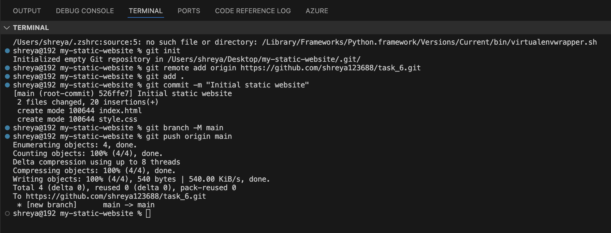

# TASK 6: Host a Static Website with GitHub Pages

## ✅ Objective
Deploy a simple HTML website using **GitHub Pages** for free.
## 🚀 Steps to Complete

### 1. Create a Project Folder
Create a folder and add an `index.html` and `style.css` file inside it.
## 2. Push to GitHub
```
git init
git add .
git commit -m "Initial static website"
git branch -M main
git remote add origin https://github.com/<your-username>/<repo-name>.git
git push -u origin main
```


## 3. Enable GitHub Pages

Go to GitHub → Repository → Settings → Pages

Under Source, select:

Branch: main; Folder: / (root)

Click Save


## 4. Get Your Live Website Link
GitHub will provide a link like:
```
https://shreya123688.github.io/task_6/
```

